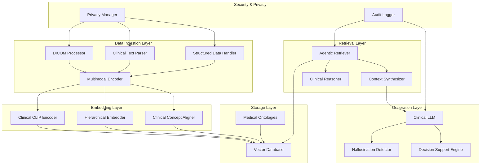

# 🏗️ EHR Multimodal RAG: System Architecture

## Overview

The EHR Multimodal RAG system represents a breakthrough in healthcare information retrieval, combining cutting-edge research in multimodal AI with clinical domain expertise. This document provides a comprehensive overview of the system's architecture, design principles, and implementation details.

## 🎯 Design Principles

### 1. Clinical-First Design
- **Medical Domain Adaptation**: All components are specifically designed for healthcare applications
- **Clinical Workflow Integration**: Seamless integration with existing EHR systems and clinical workflows
- **Evidence-Based Reasoning**: Grounded in clinical evidence and medical best practices

### 2. Research-Driven Innovation
- **State-of-the-Art Techniques**: Implementation of latest research in multimodal RAG
- **Agentic Intelligence**: AR-MCTS framework for intelligent information seeking
- **Cross-Modal Understanding**: Advanced techniques for bridging modality gaps

### 3. Privacy-by-Design
- **HIPAA Compliance**: Built-in privacy protection and regulatory compliance
- **Data Minimization**: Only necessary data is processed and stored
- **Audit Transparency**: Comprehensive logging for accountability

### 4. Scalability and Performance
- **Modular Architecture**: Components can be scaled independently
- **Efficient Processing**: Optimized for clinical-grade performance requirements
- **Real-time Capabilities**: Support for time-sensitive clinical decisions

## 🏗️ System Architecture



## 📊 Component Deep Dive

### 1. Data Ingestion Pipeline

#### DICOM Processor (`src/ingestion/dicom_processor.py`)
- **Purpose**: Process medical imaging data with clinical-grade quality
- **Key Features**:
  - Multi-modality support (CT, MRI, X-ray, Ultrasound, etc.)
  - Automated windowing and normalization
  - Clinical feature extraction
  - Quality assessment and validation
  - Privacy-preserving anonymization

#### Clinical Text Parser (`src/ingestion/clinical_text_parser.py`)
- **Purpose**: Extract and structure clinical information from text
- **Key Features**:
  - Medical NER (Named Entity Recognition)
  - Clinical concept extraction
  - Temporal information processing
  - PHI (Protected Health Information) removal

#### Structured Data Handler (`src/ingestion/structured_data_handler.py`)
- **Purpose**: Process lab results, vital signs, and other structured data
- **Key Features**:
  - Reference range normalization
  - Temporal alignment
  - Outlier detection
  - Clinical significance scoring

### 2. Embedding Layer

#### Multimodal Encoder (`src/embedding/multimodal_encoder.py`)
- **Purpose**: Create unified representations across modalities
- **Architecture**:
  ```python
  class ClinicalCLIPEncoder(nn.Module):
      def __init__(self):
          # CLIP vision encoder for medical images
          self.vision_encoder = CLIPVisionModel.from_pretrained(...)
          
          # Clinical text encoder (PubMedBERT)
          self.text_encoder = AutoModel.from_pretrained('microsoft/BiomedNLP-PubMedBERT...')
          
          # Cross-modal attention for alignment
          self.cross_attention = nn.MultiheadAttention(...)
          
          # Clinical concept alignment layer
          self.concept_alignment = nn.Linear(...)
  ```

#### Clinical Concept Aligner (`src/embedding/clinical_alignment.py`)
- **Purpose**: Align embeddings with medical ontologies
- **Key Features**:
  - SNOMED-CT integration
  - ICD-10 mapping
  - LOINC code alignment
  - RxNorm drug mapping

#### Hierarchical Embedder (`src/embedding/hierarchical_embedder.py`)
- **Purpose**: Create multi-level clinical concept representations
- **Hierarchy Levels**:
  - Symptom level
  - Diagnosis level
  - Treatment level
  - Outcome level

### 3. Intelligent Retrieval System

#### Agentic Retriever (`src/retrieval/agentic_retriever.py`)
- **Purpose**: Intelligent, self-improving retrieval system
- **Core Algorithm**: AR-MCTS (Active Retrieval Monte Carlo Tree Search)
- **Actions**:
  - Query reformulation
  - Modality focus
  - Temporal expansion
  - Concept expansion
  - Cross-reference validation
  - Result validation

#### Clinical Reasoner (`src/retrieval/clinical_reasoner.py`)
- **Purpose**: Apply clinical reasoning to retrieval process
- **Key Features**:
  - Differential diagnosis generation
  - Clinical pathway analysis
  - Evidence strength assessment
  - Uncertainty quantification

#### Context Synthesizer (`src/retrieval/context_synthesizer.py`)
- **Purpose**: Combine retrieved information into coherent context
- **Synthesis Strategies**:
  - Temporal ordering
  - Clinical relevance weighting
  - Cross-modal validation
  - Evidence triangulation

### 4. Generation Layer

#### Clinical LLM (`src/generation/clinical_llm.py`)
- **Purpose**: Generate clinically accurate and useful responses
- **Key Features**:
  - Medical knowledge grounding
  - Clinical format adherence
  - Uncertainty communication
  - Source citation

#### Hallucination Detector (`src/generation/hallucination_detector.py`)
- **Purpose**: Detect and prevent medical misinformation
- **Detection Methods**:
  - Fact verification against knowledge base
  - Consistency checking across modalities
  - Confidence scoring
  - Medical literature validation

#### Decision Support Engine (`src/generation/decision_support.py`)
- **Purpose**: Provide structured clinical decision support
- **Output Formats**:
  - Differential diagnosis lists
  - Treatment recommendations
  - Risk assessments
  - Follow-up suggestions

## 🔒 Security and Privacy Architecture

### Privacy Manager (`src/utils/privacy_utils.py`)
- **Data Anonymization**: Automatic PHI removal and replacement
- **Differential Privacy**: Noise injection for statistical privacy
- **Federated Learning**: Distributed training without data centralization
- **Homomorphic Encryption**: Computation on encrypted data

### Audit System
- **Comprehensive Logging**: All system interactions logged
- **Access Tracking**: User access patterns monitored
- **Data Lineage**: Complete data provenance tracking
- **Compliance Reporting**: Automated HIPAA compliance reports

## 📈 Performance Optimization

### Caching Strategy
- **Embedding Cache**: Frequently accessed embeddings cached
- **Query Cache**: Common queries pre-computed
- **Model Cache**: Optimized model loading and sharing

### Scalability Features
- **Horizontal Scaling**: Components can be distributed across multiple nodes
- **Load Balancing**: Intelligent request distribution
- **Resource Management**: Dynamic resource allocation based on demand

### Monitoring and Observability
- **Performance Metrics**: Real-time system performance tracking
- **Clinical Metrics**: Healthcare-specific quality measures
- **Alert System**: Proactive issue detection and notification

## 🔧 Configuration Management

### Model Configuration (`config/model_config.yaml`)
```yaml
model:
  encoder:
    type: "clinical_clip"
    embedding_dim: 768
    clinical_alignment: true
  
retrieval:
  agentic:
    enable: true
    max_iterations: 3
    confidence_threshold: 0.8
  
generation:
  hallucination_control:
    enable: true
    confidence_scoring: true
    fact_verification: true
```

### Clinical Ontologies (`config/clinical_ontologies.json`)
- SNOMED-CT mappings
- ICD-10 classifications
- LOINC laboratory codes
- RxNorm medication codes

## 🚀 Deployment Architecture

### Development Environment
- **Local Development**: Docker-based development environment
- **Testing**: Comprehensive unit, integration, and clinical validation tests
- **CI/CD**: Automated testing and deployment pipelines

### Production Deployment
- **Containerization**: Docker containers for consistent deployment
- **Orchestration**: Kubernetes for container orchestration
- **Load Balancing**: NGINX for request distribution
- **Database**: Vector database (ChromaDB/Pinecone) for embeddings

### Cloud Architecture
```
┌─────────────────┐    ┌─────────────────┐    ┌─────────────────┐
│   Load Balancer │    │   API Gateway   │    │  Auth Service   │
└─────────────────┘    └─────────────────┘    └─────────────────┘
         │                       │                       │
         └───────────────────────┼───────────────────────┘
                                 │
         ┌───────────────────────┼───────────────────────┐
         │                       │                       │
┌─────────────────┐    ┌─────────────────┐    ┌─────────────────┐
│ Ingestion Pods  │    │ Retrieval Pods  │    │Generation Pods  │
└─────────────────┘    └─────────────────┘    └─────────────────┘
         │                       │                       │
         └───────────────────────┼───────────────────────┘
                                 │
                    ┌─────────────────┐
                    │ Vector Database │
                    └─────────────────┘
```

## 🧪 Testing Strategy

### Unit Testing
- **Component Tests**: Individual component functionality
- **Integration Tests**: Component interaction testing
- **Performance Tests**: Latency and throughput validation

### Clinical Validation
- **Accuracy Testing**: Clinical accuracy of responses
- **Safety Testing**: Patient safety validation
- **Usability Testing**: Clinical workflow integration

### Security Testing
- **Penetration Testing**: Security vulnerability assessment
- **Privacy Testing**: Data protection validation
- **Compliance Testing**: Regulatory compliance verification

## 📊 Monitoring and Analytics

### System Metrics
- **Response Time**: Query processing latency
- **Throughput**: Queries processed per second
- **Resource Utilization**: CPU, memory, and storage usage
- **Error Rates**: System error frequency and types

### Clinical Metrics
- **Accuracy**: Clinical response accuracy
- **Completeness**: Information completeness
- **Relevance**: Clinical relevance of responses
- **Safety**: Patient safety indicators

### Business Metrics
- **User Adoption**: System usage patterns
- **Clinical Impact**: Improved patient outcomes
- **Efficiency Gains**: Time savings for clinicians
- **Cost Reduction**: Healthcare cost improvements

## 🔮 Future Enhancements

### Technical Roadmap
1. **Real-time Streaming**: Live data processing capabilities
2. **Advanced Reasoning**: More sophisticated clinical reasoning
3. **Multimodal Generation**: Generate images and structured data
4. **Federated Learning**: Collaborative learning across institutions

### Clinical Roadmap
1. **Specialty Modules**: Specialized models for different medical specialties
2. **Predictive Analytics**: Predictive modeling for patient outcomes
3. **Clinical Trials**: Integration with clinical trial data
4. **Population Health**: Population-level health analytics

### Research Integration
1. **Latest Research**: Continuous integration of new research findings
2. **Model Updates**: Regular model updates with new clinical data
3. **Benchmarking**: Participation in clinical AI benchmarks
4. **Publications**: Research contributions to medical AI literature

---

This architecture represents a comprehensive approach to EHR multimodal RAG, combining cutting-edge AI research with practical clinical requirements. The system is designed to be scalable, secure, and clinically effective while maintaining the highest standards of patient privacy and safety.